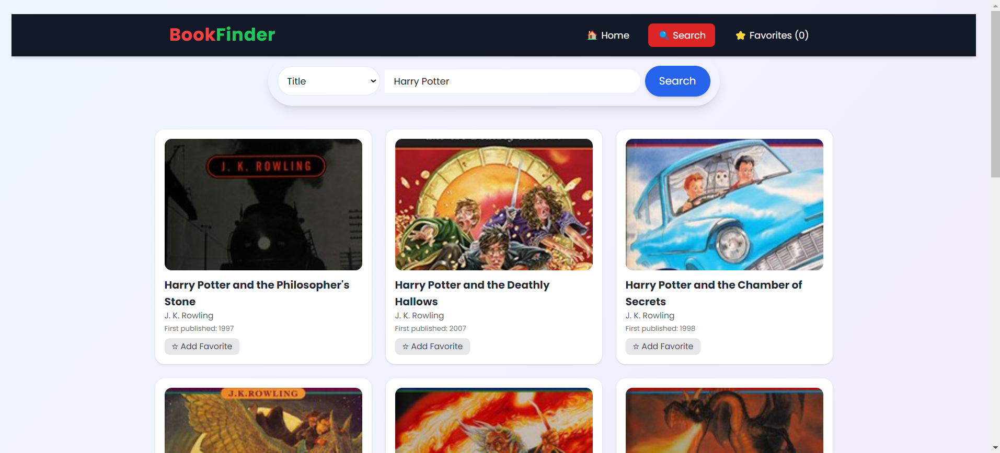
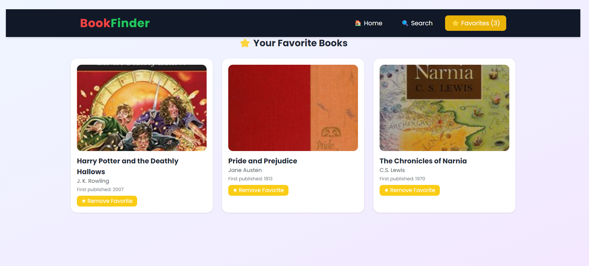

# 📚 Book Finder

Book Finder is a simple and responsive web application that allows users to search and explore books from the [Open Library API](https://openlibrary.org/developers/api).  
It provides multiple ways to search, organize, and browse books with a clean and modern interface.

---

## ✨ Features
- 🔍 Search books by:
  - Title
  - Author
  - Subject / Genre
  - ISBN
  - Publisher
  - Year of publication
- 📖 View book details: title, author(s), first publish year, and cover.
- ⭐ Save books as **Book Cards** to **Favorites** and manage them easily.
- 📑 **Pagination** with next/prev + jump to first/last page.
- 🏠 Home page for welcome screen.
- 🎨 Clean, responsive UI with Tailwind CSS.

---

## 🛠️ Tech Stack

| Technology          | Description                         |
| ------------------- | ----------------------------------- |
| ⚛️ React.js         | JavaScript library for building UI  |
| 🎨 Tailwind CSS     | Utility-first CSS framework         |
| 📡 Open Library API | Fetches book data from Open Library |

---

## 💻 Machine Requirements

Ensure your system meets these requirements:

- **Node.js**: Version 16 or later
- **npm**: Version 8 or later
- **Browser**: Chrome, Edge, or Firefox (latest versions)


---


## 📸 Screenshots

### 🌟 Homepage


### 🌟 Search Results



### 🌟 Favorites




---

## 🎥 Live Demo and Video Walkthrough

- **🔗 Live Application**: [Visit Book Finder App](https://book-finder-lyart.vercel.app/)
- **🎬 Video Walkthrough**: [Watch Working Demo](https://drive.google.com/file/d/1UzlH8TAQLGT2AJjPQlXq9yoK5Z6KFhWw/view?usp=sharing)

---

## 📌 Installation

### 1. Clone the repo
```bash
git clone https://github.com/ou786/book-finder..
cd book-finder
```
### 2. Install dependencies
```bash
npm install
```
### 3. Start development server
```bash
npm start
```

---


## 🌍 API Documentation

This application uses the **Open Library API** to fetch book details.  
📖 [Explore Open Library API](https://openlibrary.org/developers)
